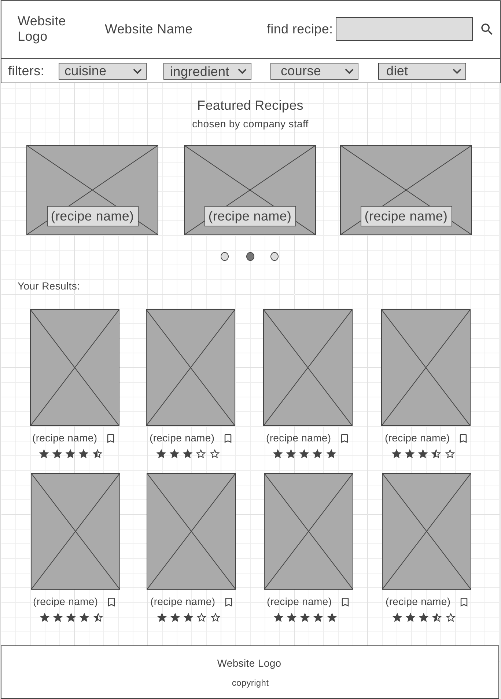
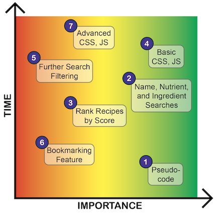

# Food + Co. Overview

Welcome to Food + Co., this is a food/recipe application run by Spoonacular API. Searching for foods based on name, desired nutrients, or ingredients....

## API and Data Sample

This project was built-out using spoonacular API, which can be found here: https://spoonacular.com/food-api. For this project, the four main HTTP requests being sent to the spoonacular API include:
- Search by Food Name: ```GET https://api.spoonacular.com/recipes/complexSearch?query={foodName}```
- Recipe by Food ID: ```GET https://api.spoonacular.com/recipes/{id}/information```

Here is an example of an advanced HTTP response that combines the name, nutrients, and ingredients searches for the request of (```name = pasta, maxFat = 25```) ```GET https://api.spoonacular.com/recipes/complexSearch?query=pasta&maxFat=25&number=2```:
```
{
    "offset": 0,
    "number": 2,
    "results": [
        {
            "id": 716429,
            "calories": 584,
            "carbs": "84g",
            "fat": "20g",
            "image": "https://spoonacular.com/recipeImages/716429-312x231.jpg",
            "imageType": "jpg",
            "protein": "19g",
            "title": "Pasta with Garlic, Scallions, Cauliflower & Breadcrumbs"
        },
        {
            "id": 715538,
            "calories": 521,
            "carbs": "69g",
            "fat": "10g",
            "image": "https://spoonacular.com/recipeImages/715538-312x231.jpg",
            "imageType": "jpg",
            "protein": "35g",
            "title": "What to make for dinner tonight?? Bruschetta Style Pork & Pasta"
        }
    ],
    "totalResults": 86
}
```

## Wireframes


This wireframe representation of Fork + Co. can be found at: https://wireframe.cc/ubTlr7.

## MVP 

- Make HTTP requests based on food name 
- Make HTTP requests based on food ID to retrieve recipes
- Display user food search results and recipes

## PostMVP  

- Rank recipes by their spoonacular score
- Allow users to filter their recipe search by nutrients, ingredients, cuisines, diets, intolerances, etc.
- Allow users to bookmark recipes found during their browser session
- Advanced CSS styling and animation

## Project Schedule

|  Day | Deliverable | Status
|---|---| ---|
|Dec 21| Prompt / Wireframes / Priority Matrix | Complete
|Dec 21| Project Approval | Complete
|Dec 21| Pseudocode | Complete
|Dec 22| Search Function | Complete
|Dec 23| Rank Recipes by score | Complete
|Dec 25| Base HTML, CSS, JS | Complete
|Dec 25| MVP | Complete
|Jan 5| Presentations | Incomplete

## Priority Matrix



## Timeframes

| Component | Priority | Estimated Time | Actual Time |
| --- | :---: |  :---: | :---: |
| Pseudocode | H | 0.5hrs | 0.5hrs |
| Basic Search | H | 4hrs | 1hr |
| Rank Recipes by score | H | 3hrs | 3hrs |
| Base HTML, CSS, JS | H | 6hrs | 4hrs |
| Nutrient, Ingredient and Further Search Filtering | L | 4hrs | N/A |
| Bookmarking Feature | L | 1hr | N/A |
| Advanced CSS | M | 5hrs | 4hrs |
| Total | H | 23.5hrs | 18.5hrs |

## Code Snippet

Use this section to include a brief code snippet of functionality that you are proud of and a brief description.  

## Change Log
 Use this section to document what changes were made and the reasoning behind those changes.  
